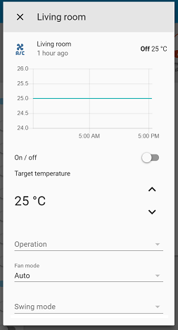
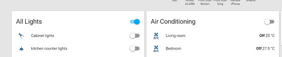

# FGLair&trade; integration for homeassistant

[![GitHub Release][releases-shield]][releases]
![Project Stage][project-stage-shield]
[![License][license-shield]](LICENSE.md)

![Maintenance][maintenance-shield]
[![GitHub Activity][commits-shield]][commits]

[](https://www.buymeacoffee.com/bigmoby)


This is a platform to support Fujitsu General Airconditioners under Climate component of Home Assistant. The Python supporting library for accessing the FGLair&trade; API is located at: https://github.com/bigmoby/pyfujitsugeneral/

## Sample UI:




## Installation

### Manual

1. Create this directory path `custom_components/fglair_heatpump_controller/` if it does not already exist.

2. Download the all `custom_components/fglair_heatpump_controller/` files from the repo and place it in the directory mentioned in previous step.

### HACS

1. Add this repository to HACS:

```
https://github.com/bigmoby/fglair_for_homeassistant
```

2. Search for the `FGLair integration for homeassistant` integration and choose install.

3. Reboot Home Assistant.

### Usage:

In Home Assistant->Settings->Device & services->Integration menu add the new integration FGLair and configure it.

Please, use your FGLair app username/password and region your FGLair account is registered (choose one of `region`: `eu`, `cn` or `us`). For `tokenpath` field you could leave the default value `token.txt`. You could set a proper `temperature_offset`, default will be `2`.

Attention: please, remove from `configuration.yaml` any previous FGLair installation setup.

Note for A/C units with horizontal swing support, the horizontal swing and position can be changed but only the vertical position will be shown due to limitations with Home Assistant's climate entity.

## Known issues and missing features:

- [x] Logging needs to be implemented
- [x] The “powerful” functionality is implemented via the preset selections in the UI
- [ ] There are some other functionalities in the A/C which currently is not implemented.
- [ ] Possibility to add external temperature sensor

##

\*\* "FGLair" is a trademark of FUJITSU GENERAL LIMITED.

[releases-shield]: https://img.shields.io/github/release/bigmoby/fglair_for_homeassistant.svg
[releases]: https://github.com/bigmoby/fglair_for_homeassistant/releases
[project-stage-shield]: https://img.shields.io/badge/project%20stage-production%20ready-brightgreen.svg
[license-shield]: https://img.shields.io/github/license/bigmoby/fglair_for_homeassistant
[maintenance-shield]: https://img.shields.io/maintenance/yes/2023.svg
[commits-shield]: https://img.shields.io/github/commit-activity/y/bigmoby/fglair_for_homeassistant.svg
[commits]: https://img.shields.io/github/commits/bigmoby/fglair_for_homeassistant
